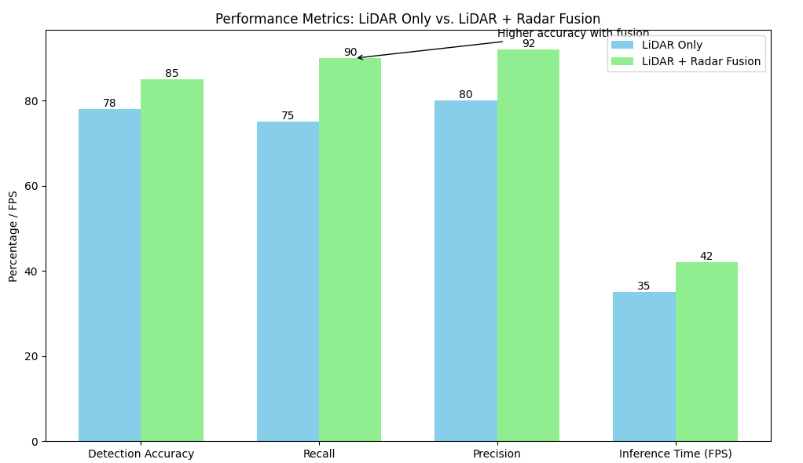

# EGR 598 Capstone: Advanced Pedestrian Detection with Sensor Fusion

> My Master's capstone project developing a robust pedestrian detection system for autonomous vehicles by fusing LiDAR and Radar data in the high-fidelity CARLA simulator. This project showcases advanced skills in sensor fusion, machine learning, and simulation for creating safer autonomous systems.

---

### 🎯 Project Objective

The primary goal of this project was to solve a critical weakness in modern autonomous systems: unreliable pedestrian detection in adverse weather conditions like rain, fog, and at night.  [cite_start]By developing a multi-modal sensor fusion framework, this project aimed to create a perception system that is significantly more robust and reliable than systems that depend on a single sensor. 

---

### 🛠️ Methodology & Technology

To achieve this, I engineered a complete pipeline from simulation setup to model validation.

* **Simulation Environment:** All testing was performed in the **CARLA open-source simulator (v0.9.15)**.  This allowed for the creation of repeatable, controlled test scenarios with diverse and challenging environmental conditions.

* **Core Algorithm:** The system is built on the **PointPillars** algorithm. We chose this because it is highly efficient at processing raw LiDAR point cloud data. [cite_start]It voxelizes the point cloud into 2D pillars and converts it into a pseudo-image format, allowing for fast and effective 2D convolutional processing, which is ideal for real-time applications. 

* **Sensor Fusion Strategy:**
    * **LiDAR:** Provided high-resolution 3D spatial data for precise object localization. 
    * **Radar:** Provided crucial velocity and position data, which is highly effective even in poor weather where LiDAR performance degrades. 
    * **Fusion Technique:** The LiDAR and Radar data streams were carefully synchronized and calibrated.  [cite_start]A **Kalman Filter** was then used to fuse the data, providing an optimal and continuously refined estimate of a pedestrian's position and velocity while mitigating sensor noise. 

---

### 📊 Key Results & Performance Gains

The sensor fusion model demonstrated significant performance gains over a LiDAR-only baseline, proving the success of the multi-modal approach.

* **Detection Accuracy:** Improved from 78% (LiDAR only) to **85%** with fusion. 
* **Object Recall:** Increased dramatically from 75% to **90%**, meaning the system was much better at finding objects that the single sensor missed, especially in scenarios with occlusion. 
* **Precision:** Rose from 80% to **92%**, indicating a significant reduction in false positive detections. 
* **Real-Time Performance:** Maintained an efficient **42 FPS** inference time, proving its suitability for real-world autonomous systems. 

  

---

### 📄 View Full Project Files

For a complete breakdown of the methodology, mathematical models, data visualizations, and code snippets, please see the full report and presentation.

* [**View the Final Report (PDF)**](./Aniket%20Mishra%20EGR598%20Final%20Report.pdf)
* [**View the Final Presentation (PDF)**](./EGR%20598%20Final%20Presentation%20Aniket%20Mishra.pdf)
